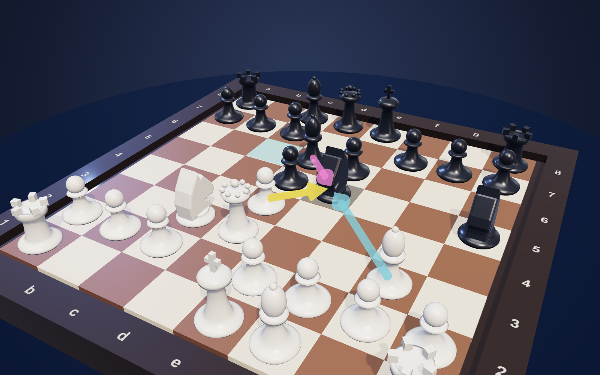
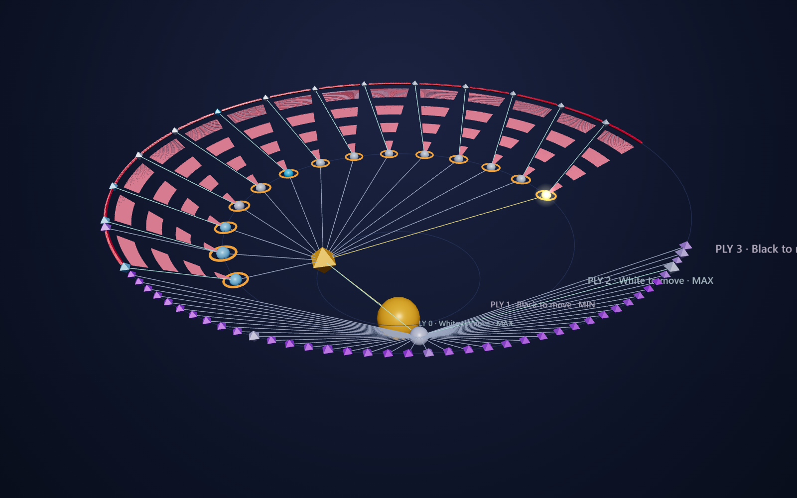
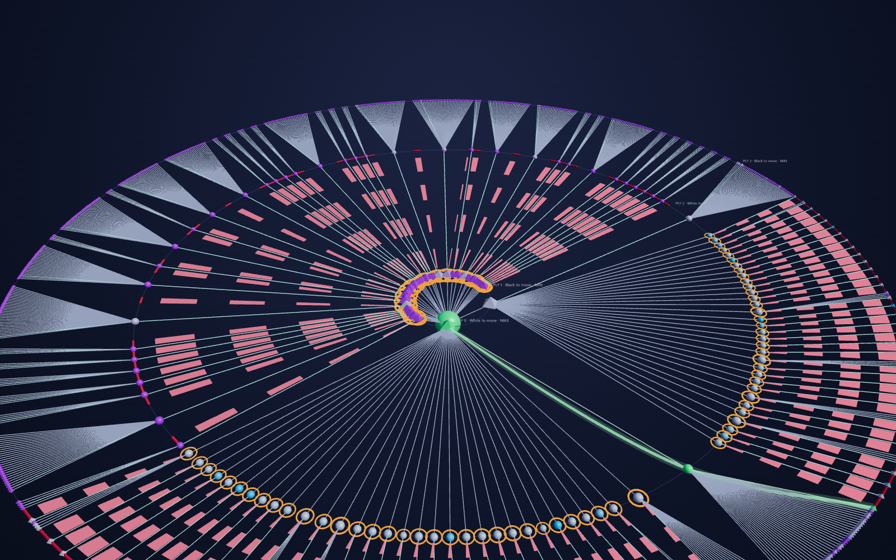

# Chess Tree 3D

A 3D chess game whose AI thinks out loud: minimax + alpha-beta pruning, with the search tree drawn live in 3D next to the board.

*Screenshots are the two WebGL views only (board and tree); the HUD, labels and side panels are HTML and aren't in them.*

**Run:** open `index.html` in a modern browser (no install, no build; three.js is vendored in `vendor/`).
Optional dev server: `powershell -File serve.ps1` → http://localhost:8765. Engine tests: open `tests/test.html` (perft + search checks).

## Using it
- Click a piece, then a highlighted square. Drag = rotate, right-drag = pan, wheel = zoom (both 3D views).
- Top bar: mode (you as White / Black / AI vs AI), difficulty (search depth 1–6), New game, Undo, Pause/Resume, Step (one node at a time while paused), Hint.
- Tree: click a node to inspect it (position, α/β window, value, evaluation breakdown); double-click to fly to it; hover for a tooltip. The examined line is drawn as arrows on the board.
- Sidebar → *Search & display settings*: visualisation speed, tree detail (1–4 plies recorded), toggle alpha-beta pruning or move ordering to compare node counts.
- Keys: Space pause, S step, U undo, N new game, F fit tree.

## Reading the tree
Spheres = MAX nodes (White to move), diamonds = MIN nodes. Colour = minimax value (cyan good for White, violet good for Black). Size = positions searched beneath the node. Yellow = evaluating now, amber = current path, teal edge = child the minimax picked, **orange ring + shock-wave = cutoff**, **red dashed = pruned (never searched)**, green tube = best line.

## Layout
`src/chess.js` rules · `src/eval.js` evaluation · `src/search.js` generator-based alpha-beta (records top plies as a tree) · `src/tree3d.js`, `src/board3d.js`, `src/pieces.js` 3D · `src/main.js` UI/game flow.
